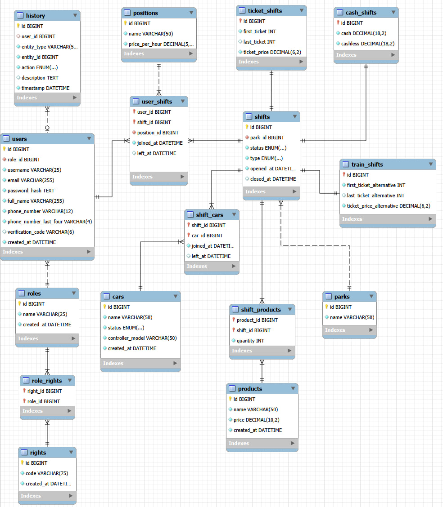

# Словарь данных SiGDB

## Содержание

- [Словарь данных SiGDB](#словарь-данных-sigdb)
  - [Содержание](#содержание)
- [EER-диаграмма](#eer-диаграмма)
- [Таблицы](#таблицы)
  - [roles](#roles)
  - [users](#users)
  - [parks](#parks)
  - [shifts](#shifts)
  - [positions](#positions)
  - [ticket\_shifts](#ticket_shifts)
  - [cash\_shifts](#cash_shifts)
  - [train\_shifts](#train_shifts)
  - [products](#products)
  - [cars](#cars)
  - [user\_shifts](#user_shifts)
  - [shift\_cars](#shift_cars)
  - [shift\_products](#shift_products)
  - [rights](#rights)
  - [role\_rights](#role_rights)
  - [history](#history)
- [Правила внешних ключей](#правила-внешних-ключей)
  - [Используемые правила](#используемые-правила)

---

# EER-диаграмма

---

# Таблицы

## roles

Хранит роли пользователей системы.

| Поле | Тип | Nullable | Индексация | Описание |
|------|-----|----------|-------------|----------|
| id | BIGINT | Нет | PRIMARY KEY | Идентификатор роли |
| name | VARCHAR(25) | Нет | UNIQUE | Наименование роли |
| created_at | DATETIME | Нет | Нет | Дата создания |

---

## users

Хранит учетные записи пользователей.

| Поле | Тип | Nullable | Индексация | Описание |
|------|-----|----------|-------------|----------|
| id | BIGINT | Нет | PRIMARY KEY | Идентификатор пользователя |
| role_id | BIGINT | Нет | INDEX, FK | Роль пользователя |
| username | VARCHAR(25) | Нет | UNIQUE | Логин |
| email | VARCHAR(255) | Нет | UNIQUE | Электронная почта |
| password_hash | TEXT | Нет | Нет | Хэш пароля |
| full_name | VARCHAR(255) | Нет | Нет | ФИО |
| phone_number | VARCHAR(12) | Нет | UNIQUE | Номер телефона |
| phone_number_last_four | VARCHAR(4) | Нет | INDEX | Последние четыре цифры номера телефона |
| verification_code | VARCHAR(6) | Да | Нет | Код подтверждения |
| created_at | DATETIME | Нет | Нет | Дата регистрации |

---

## parks

Справочник парков.

| Поле | Тип | Nullable | Индексация | Описание |
|------|-----|----------|-------------|----------|
| id | BIGINT | Нет | PRIMARY KEY | Идентификатор парка |
| name | VARCHAR(50) | Нет | UNIQUE | Название парка |

---

## shifts

Основная информация о сменах.

| Поле | Тип | Nullable | Индексация | Описание |
|------|-----|----------|-------------|----------|
| id | BIGINT | Нет | PRIMARY KEY | Идентификатор смены |
| park_id | BIGINT | Нет | INDEX, FK | Парк проведения |
| status | ENUM | Нет | Нет | Статус смены |
| type | ENUM | Нет | Нет | Тип смены |
| opened_at | DATETIME | Нет | Нет | Время открытия |
| closed_at | DATETIME | Да | Нет | Время закрытия |

---

## positions

Справочник должностей.

| Поле | Тип | Nullable | Индексация | Описание |
|------|-----|----------|-------------|----------|
| id | BIGINT | Нет | PRIMARY KEY | Идентификатор должности |
| name | VARCHAR(50) | Нет | UNIQUE | Название должности |
| price_per_hour | DECIMAL(5,2) | Нет | Нет | Почасовая ставка |

---

## ticket_shifts

Билетная информация смены.

| Поле | Тип | Nullable | Индексация | Описание |
|------|-----|----------|-------------|----------|
| id | BIGINT | Нет | PRIMARY KEY, FK | Идентификатор смены |
| first_ticket | INT | Нет | Нет | Первый билет |
| last_ticket | INT | Да | Нет | Последний билет |
| ticket_price | DECIMAL(6,2) | Нет | Нет | Стоимость билета |

---

## cash_shifts

Денежная информация смены.

| Поле | Тип | Nullable | Индексация | Описание |
|------|-----|----------|-------------|----------|
| id | BIGINT | Нет | PRIMARY KEY, FK | Идентификатор смены |
| cash | DECIMAL(18,2) | Нет | Нет | Наличная выручка |
| cashless | DECIMAL(18,2) | Нет | Нет | Безналичная выручка |

---

## train_shifts

Дополнительная билетная информация для аттракциона «Паровозик».

| Поле | Тип | Nullable | Индексация | Описание |
|------|-----|----------|-------------|----------|
| id | BIGINT | Нет | PRIMARY KEY, FK | Идентификатор смены |
| first_ticket_alternative | INT | Нет | Нет | Первый альтернативный билет |
| last_ticket_alternative | INT | Да | Нет | Последний альтернативный билет |
| ticket_price_alternative | DECIMAL(6,2) | Нет | Нет | Стоимость альтернативного билета |

---

## products

Товары.

| Поле | Тип | Nullable | Индексация | Описание |
|------|-----|----------|-------------|----------|
| id | BIGINT | Нет | PRIMARY KEY | Идентификатор товара |
| name | VARCHAR(50) | Нет | UNIQUE | Наименование |
| price | DECIMAL(10,2) | Нет | Нет | Цена |
| created_at | DATETIME | Нет | Нет | Дата создания |

---

## cars

Автомобили аттракциона.

| Поле | Тип | Nullable | Индексация | Описание |
|------|-----|----------|-------------|----------|
| id | BIGINT | Нет | PRIMARY KEY | Идентификатор автомобиля (задается клиентом) |
| name | VARCHAR(50) | Нет | UNIQUE | Название автомобиля |
| status | ENUM | Нет | Нет | Состояние |
| controller_model | VARCHAR(50) | Нет | Нет | Модель контроллера |
| created_at | DATETIME | Нет | Нет | Дата создания |

---

## user_shifts

Связь сотрудников со сменами.

| Поле | Тип | Nullable | Индексация | Описание |
|------|-----|----------|-------------|----------|
| user_id | BIGINT | Нет | PRIMARY KEY, INDEX, FK | Пользователь |
| shift_id | BIGINT | Нет | PRIMARY KEY, INDEX, FK | Смена |
| position_id | BIGINT | Нет | INDEX, FK | Должность |
| joined_at | DATETIME | Нет | Нет | Время начала работы |
| left_at | DATETIME | Да | Нет | Время окончания работы |

---

## shift_cars

Автомобили, участвующие в смене.

| Поле | Тип | Nullable | Индексация | Описание |
|------|-----|----------|-------------|----------|
| shift_id | BIGINT | Нет | PRIMARY KEY, INDEX, FK | Смена |
| car_id | BIGINT | Нет | PRIMARY KEY, INDEX, FK | Автомобиль |
| joined_at | DATETIME | Нет | Нет | Время добавления |
| left_at | DATETIME | Да | Нет | Время удаления |

---

## shift_products

Товары, выданные на смену.

| Поле | Тип | Nullable | Индексация | Описание |
|------|-----|----------|-------------|----------|
| product_id | BIGINT | Нет | PRIMARY KEY, INDEX, FK | Товар |
| shift_id | BIGINT | Нет | PRIMARY KEY, INDEX, FK | Смена |
| quantity | INT | Нет | Нет | Количество |

---

## rights

Справочник прав доступа.

| Поле | Тип | Nullable | Индексация | Описание |
|------|-----|----------|-------------|----------|
| id | BIGINT | Нет | PRIMARY KEY | Идентификатор права |
| code | VARCHAR(75) | Нет | UNIQUE | Код права |
| created_at | DATETIME | Нет | Нет | Дата создания |

---

## role_rights

Связь ролей и прав доступа.

| Поле | Тип | Nullable | Индексация | Описание |
|------|-----|----------|-------------|----------|
| right_id | BIGINT | Нет | PRIMARY KEY, INDEX, FK | Право |
| role_id | BIGINT | Нет | PRIMARY KEY, INDEX, FK | Роль |

---

## history

Журнал изменений базы данных.

| Поле | Тип | Nullable | Индексация | Описание |
|------|-----|----------|-------------|----------|
| id | BIGINT | Нет | PRIMARY KEY | Идентификатор записи |
| user_id | BIGINT | Да | INDEX, FK | Пользователь, выполнивший действие |
| entity_type | VARCHAR(50) | Нет | INDEX | Тип сущности |
| entity_id | BIGINT | Нет | INDEX | Идентификатор сущности |
| action | ENUM | Нет | INDEX | Выполненное действие |
| description | TEXT | Да | Нет | Дополнительное описание |
| timestamp | DATETIME | Нет | Нет | Время события |

---

# Правила внешних ключей

| Таблица | Поле | Ссылка | ON DELETE | ON UPDATE |
|----------|------|---------|-----------|-----------|
| users | role_id | roles(id) | RESTRICT | CASCADE |
| shifts | park_id | parks(id) | RESTRICT | CASCADE |
| ticket_shifts | id | shifts(id) | CASCADE | CASCADE |
| cash_shifts | id | shifts(id) | CASCADE | CASCADE |
| train_shifts | id | shifts(id) | CASCADE | CASCADE |
| user_shifts | user_id | users(id) | RESTRICT | CASCADE |
| user_shifts | shift_id | shifts(id) | CASCADE | CASCADE |
| user_shifts | position_id | positions(id) | RESTRICT | RESTRICT |
| shift_cars | shift_id | shifts(id) | CASCADE | CASCADE |
| shift_cars | car_id | cars(id) | RESTRICT | CASCADE |
| shift_products | product_id | products(id) | RESTRICT | CASCADE |
| shift_products | shift_id | shifts(id) | CASCADE | CASCADE |
| role_rights | right_id | rights(id) | CASCADE | CASCADE |
| role_rights | role_id | roles(id) | CASCADE | CASCADE |
| history | user_id | users(id) | SET NULL | CASCADE |

## Используемые правила

| Правило | Описание |
|----------|----------|
| **CASCADE** | Изменения или удаление родительской записи автоматически применяются к дочерним записям. |
| **RESTRICT** | Запрещает удаление или изменение родительской записи при наличии связанных данных. |
| **SET NULL** | При удалении родительской записи значение внешнего ключа устанавливается в `NULL`. |